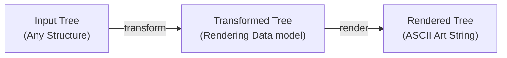
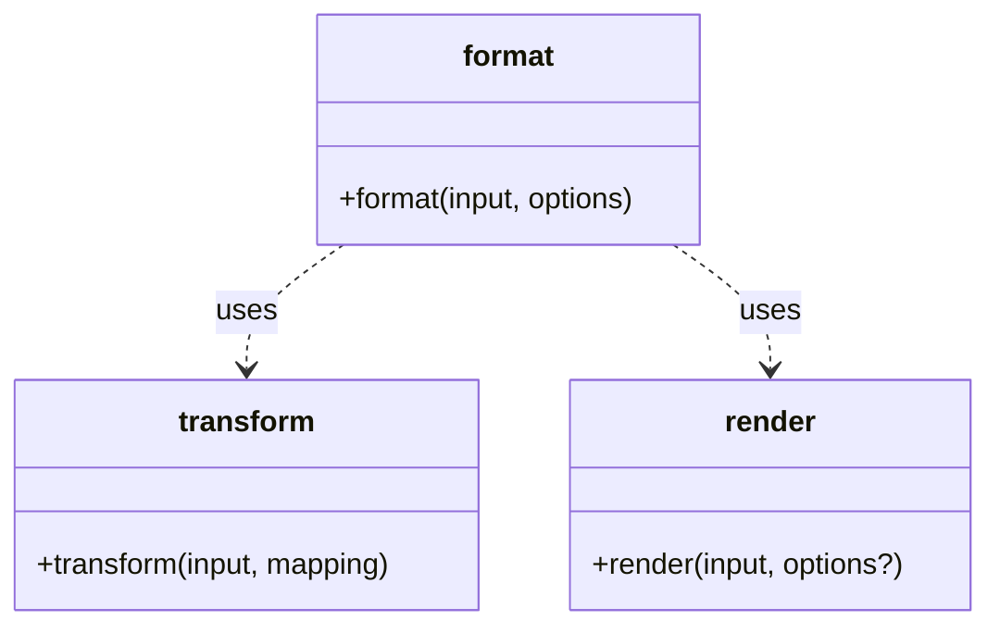

# printree

A flexible TypeScript library for rendering tree structures as ASCII art.

## Installation

```bash
npm install @suin/printree
```

## Features

- 🌳 Render any tree structure as ASCII art
- 🎨 Fully customizable node formatting
- 🏷️ Support for labeled nodes
- 📊 Optional node indices and children count
- 📁 Perfect for directory trees, JSON AST, and more
- 💪 Written in TypeScript with full type safety


## Usage

### Basic Example

```typescript
import { format } from "@suin/printree";

// Define your tree node types
type Node = Parent | Leaf;
type Parent = { kind: string; children: Node[] };
type Leaf = { kind: string; value: string };

// Create your tree
const tree: Node = {
  kind: "root",
  children: [
    {
      kind: "node",
      children: [
        { kind: "leaf", value: "Hello" },
        { kind: "leaf", value: "World!" },
      ],
    },
  ],
};

// Format it!
const result = format(tree, {
  mapping: {
    getChildren: node => "children" in node ? node.children : undefined,
    toText: node => {
      let text = node.kind;
      if ("value" in node) {
        text += `: ${JSON.stringify(node.value)}`;
      }
      return text;
    },
  },
});

console.log(result);
```

Output:
```
root
└─ node
   ├─ leaf: "Hello"
   └─ leaf: "World!"
```

### Directory Tree Example

```typescript
type Entry = Directory | File;
type Directory = { type: "directory"; name: string; children: Entry[] };
type File = { type: "file"; name: string };

const tree: Entry = {
  type: "directory",
  name: ".",
  children: [
    {
      type: "directory",
      name: "src",
      children: [
        { type: "file", name: "index.ts" },
        { type: "file", name: "utils.ts" },
      ],
    },
    {
      type: "directory",
      name: "test",
      children: [
        { type: "file", name: "index.test.ts" },
        { type: "file", name: "utils.test.ts" },
      ],
    },
  ],
};

const result = format(tree, {
  mapping: {
    getChildren: node => node.type === "directory" ? node.children : undefined,
    toText: node => node.name,
  },
});

console.log(result);
```

Output:
```
.
├─ src
│  ├─ index.ts
│  └─ utils.ts
└─ test
   ├─ index.test.ts
   └─ utils.test.ts
```

### JSON AST Example

```typescript
type Node = ObjectNode | ArrayNode | ValueNode;
type ObjectNode = { type: "Object"; properties: Record<string, Node> };
type ArrayNode = { type: "Array"; elements: Node[] };
type ValueNode = { type: "Scalar"; value: string };

const ast: Node = {
  type: "Object",
  properties: {
    hello: { type: "Scalar", value: "world" },
    nested: {
      type: "Object",
      properties: {
        array: {
          type: "Array",
          elements: [
            { type: "Scalar", value: "one" },
            { type: "Scalar", value: "two" },
          ],
        },
      },
    },
  },
};

const result = format(ast, {
  mapping: {
    getChildren: node => {
      if (node.type === "Array") {
        return node.elements;
      }
      if (node.type === "Object") {
        return Object.entries(node.properties).map(([name, node]) => ({
          name,
          node,
        }));
      }
      return undefined;
    },
    toText: (node, { name }) => {
      const propertyName = name ? `${name}: ` : "";
      if (node.type === "Scalar") {
        return `${propertyName}${JSON.stringify(node.value)}`;
      }
      return `${propertyName}${node.type}`;
    },
  },
});

console.log(result);
```

Output:
```
Object
├─ hello: "world"
└─ nested: Object
   └─ array: Array
      ├─ "one"
      └─ "two"
```

### Advanced Features

#### Node Indices

```typescript
const result = format(tree, {
  mapping: {
    getChildren: node => "children" in node ? node.children : undefined,
    toText: (node, { index }) => {
      let text = node.kind;
      if ("value" in node) {
        text += `: ${JSON.stringify(node.value)}`;
      }
      return index !== undefined ? `${index} ${text}` : text;
    },
  },
});
```

Output:
```
0 root
├─ 0 node
│  ├─ 0 leaf: "Hello"
│  └─ 1 leaf: "World!"
└─ 1 node
   ├─ 0 leaf: "Bonjour"
   └─ 1 leaf: "le monde!"
```

#### Children Count

```typescript
const result = format(tree, {
  mapping: {
    getChildren: node => "children" in node ? node.children : undefined,
    toText: (node, { children }) => {
      let text = node.kind;
      if (children) {
        text += `[${children.length}]`;
      }
      if ("value" in node) {
        text += `: ${JSON.stringify(node.value)}`;
      }
      return text;
    },
  },
});
```

Output:
```
root[2]
├─ node[2]
│  ├─ leaf: "Hello"
│  └─ leaf: "World!"
└─ node[2]
   ├─ leaf: "Bonjour"
   └─ leaf: "le monde!"
```

## API Reference

### `format<T>(input: Input<T>, options: Options<T>): string`

Formats a tree structure into a human-readable ASCII tree representation.

#### Options

```typescript
interface Options<T> {
  /** Mapping configuration for transforming the input tree */
  readonly mapping: Mapping<T>;
  /** Optional rendering configuration for customizing the output appearance */
  readonly rendering?: undefined | RenderingOptions;
}

interface Mapping<T> {
  /** Get children of a node (return undefined for leaf nodes) */
  getChildren(node: T): undefined | Children<T>;
  /** Generate text representation of a node */
  toText(node: T, context: Context<T>): string;
}

interface Context<T> {
  /** Optional name for labeled nodes */
  readonly name?: undefined | string;
  /** Index of the node among its siblings */
  readonly index: number;
  /** Children of the node if any */
  readonly children?: undefined | ReadonlyArray<T | ReadonlyArray<T>>;
}
```

## Architecture

### Data Flow



### Module Structure




## License

MIT

## Author

[suin](https://github.com/suin)
